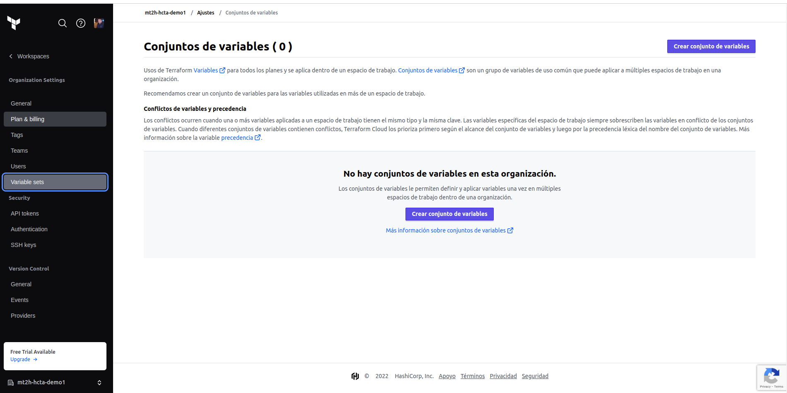
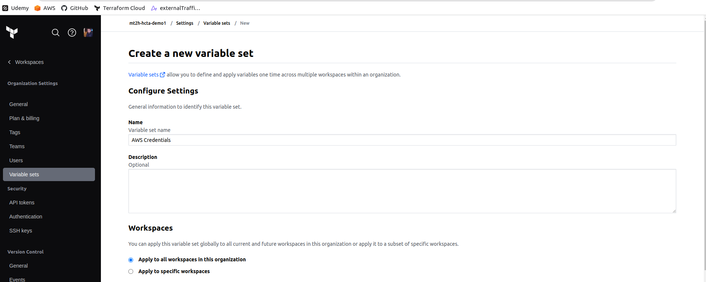
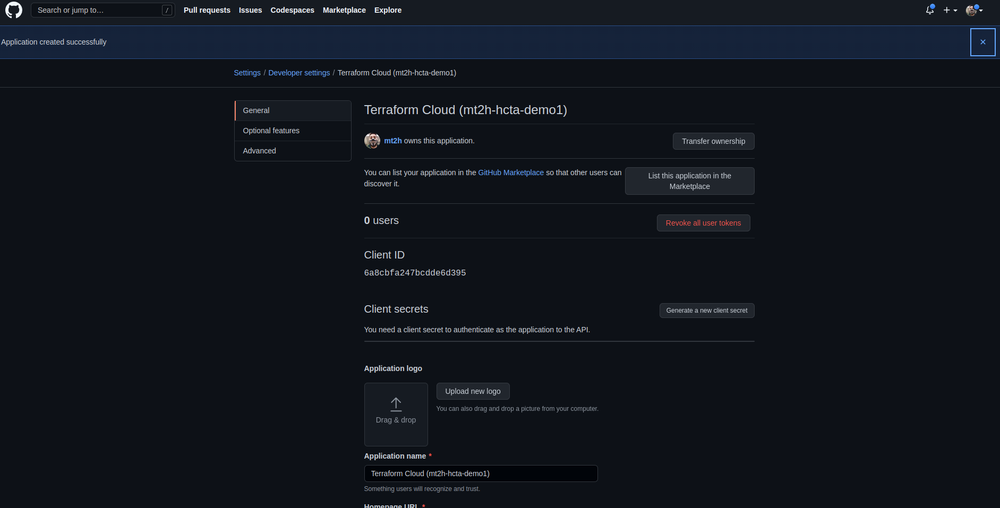

# Terraform

## isntall

```bash
wget https://releases.hashicorp.com/terraform/0.14.6/terraform_0.14.6_linux_amd64.zip
unzip terraform_0.14.6_linux_amd64.zip
rm terraform_0.14.6_linux_amd64.zip
chmod +x terraform
sudo mv terraform /usr/local/bin/terraform
terraform version
```

## Configure AWS

```bash
sudo apt-get install awscli
which aws
aws --version
aws configure
aws s3 ls
cat $HOME/.aws/credentials
```

## Terraform Basic

```bash
cd 02-Terraform-Basics/02-02-Terraform-Command-Basics/terraform-manifests
terraform init
terraform validate
terraform plan
terraform apply
terraform destroy
```

## Terraform Blocks


## Terraform Meta-Arguments


## To connect EC2

To connect to EC2 is whit key pem, this key should be chmod 400

## Data Sources


## Terraform Cloud

Create a repo


Configure Terraform Cloud









View Credentials

```bash
cat ~/.terraform.d/credentials.tfrc.json
```

CLI Driven Workspace


## Sentinel


